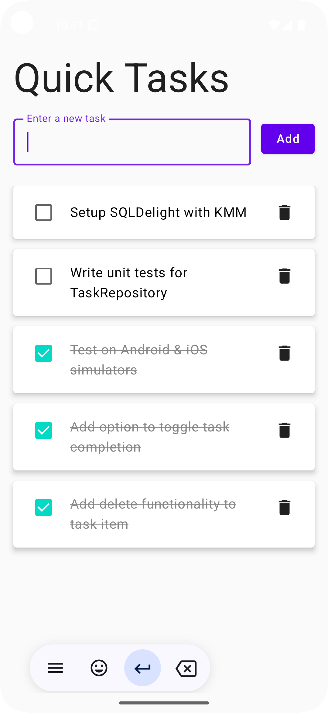
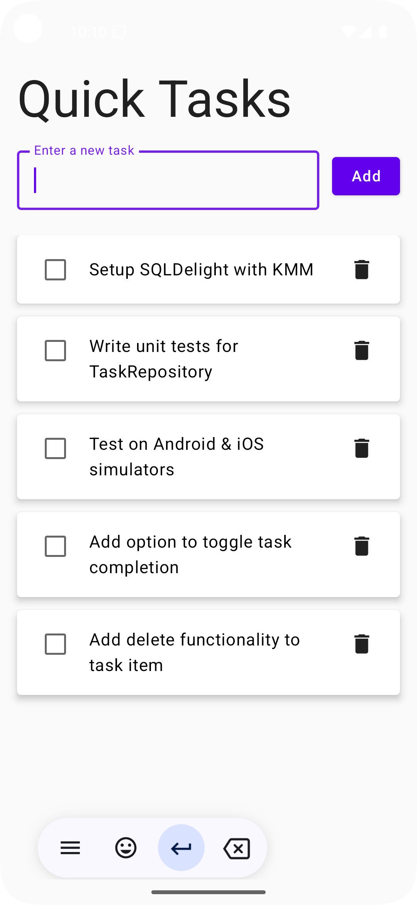
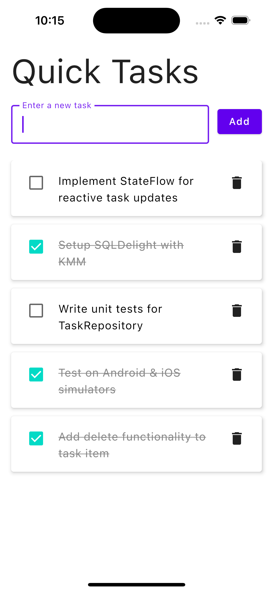
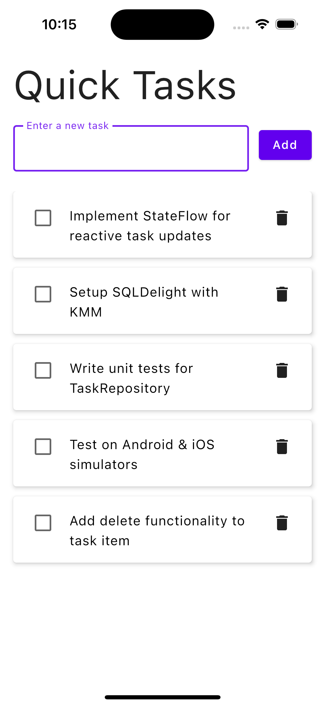

# 📋 QuickTasks

**QuickTasks** is a minimalist yet powerful **Compose Multiplatform** To-Do application built with Kotlin Multiplatform Mobile (KMM), SQLDelight, and StateFlow. It supports full CRUD operations, reactive UI updates, and runs seamlessly on both Android and iOS.

---

## ✨ Features

- ✅ Add, update, delete tasks
- ✅ Mark tasks as completed/incomplete
- ✅ Cross-platform UI with Jetpack Compose Multiplatform
- ✅ Local storage using SQLDelight
- ✅ Reactive data layer with Kotlin Flows
- ✅ Clean, modern Material design

---

## 🛠️ Built With

- **Jetpack Compose Multiplatform** — UI layer for Android and iOS
- **Kotlin Multiplatform** — shared business logic
- **SQLDelight** — type-safe database and schema management
- **Kotlin Flows** — reactive state updates
- **StateFlow + ViewModel** — state management
- **Android Studio Giraffe or later**

---

## 📱 UI Preview

| Add Task | Task List |
|----------|-----------|
|  |  |
|  |  |

---

## 🔧 How to Run

### 🤖 Android
1. Open the project in Android Studio
2. Select Android module
3. Click ▶️ to run on emulator/device

### 👩🏻‍💻 iOS
1. Open iOS module in Xcode (via `iosApp` folder)
2. Select simulator
3. Build & run using the Compose Multiplatform framework

---